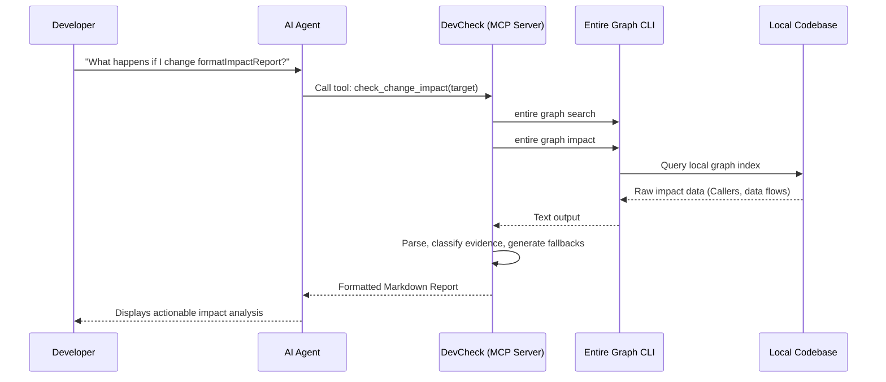
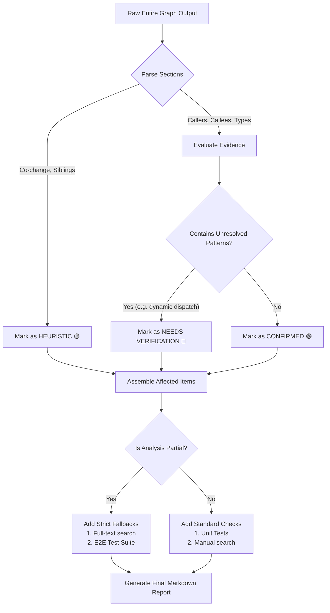

# 🔍 DevCheck

**Track 2: Build with Graph Intelligence**

DevCheck is a local **Model Context Protocol (MCP)** server powered by Entire Graph. It equips AI coding assistants with the ability to safely and intelligently predict the "blast radius" of code changes before they are made.

By turning raw structural graph evidence into an actionable, hedged, and verified workflow, DevCheck bridges the gap between static analysis and agentic coding.

---

## 🚀 The Problem

When developers or AI agents modify complex codebases, they risk breaking unseen dependencies (callers, callees, type consumers, or data flows). Standard text-based search (grep) is often too noisy or misses structural relationships.

While **Entire Graph** provides powerful structural data, raw graph output is dense. It requires interpretation, uncertainty handling (for things like dynamic dispatch), and safe fallback mechanisms.

## 💡 The Solution

DevCheck wraps the Entire Graph CLI into a standardized MCP server. When an AI agent needs to understand the impact of modifying a function, it silently calls DevCheck. 

DevCheck executes the Graph queries, interprets the results, classifies the evidence (Confirmed vs. Heuristic), handles unresolved patterns, and returns a beautifully formatted Markdown report with actionable fallbacks directly into the chat.

---

## ⚙️ How It Works

### 1. High-Level Architecture
DevCheck acts as a bridge between the AI Assistant and the local codebase's Entire Graph index.



### 2. Evidence Processing Pipeline
The core value of DevCheck is its parsing and classification engine (`report.ts`). It doesn't just pass raw data; it structures and scrutinizes it.



---

## ✨ Key Features

1. **Uncertainty Handling**: DevCheck never presents incomplete relationships as absolute truth. If Entire Graph flags an "unresolved caller" (e.g., due to reflection or dynamic dispatch), DevCheck explicitly triggers a `[!WARNING]` block.
2. **Evidence Distinction**: Every affected item is badged:
   * 🟢 `[CONFIRMED]` - Strict structural dependencies (Callers, Type Consumers).
   * 🟡 `[HEURISTIC]` - Statistical relationships (Co-change files, Siblings).
   * 🔴 `[NEEDS VERIFICATION]` - Unresolved patterns requiring human eyes.
3. **Smart Fallbacks**: If the analysis is partial, DevCheck alters its "Recommended Checks" to enforce safe fallbacks.
4. **Agent-Optimized Formatting**: The output uses hedging language ("Changing X *may* affect Y") and always concludes with a mandatory verification disclaimer.

---

## 🛠️ Usage & Integration

### Requirements
* Node.js (v18+)
* `entire` CLI installed and authenticated
* `graph` plugin installed (`entire plugin install graph`)

### Setup
1. Clone this repository.
2. Navigate to `devcheck/` and run `npm install`.
3. Build the project: `npm run build`.
4. Add the MCP server to your AI IDE (e.g., Antigravity or Cursor) by pointing the configuration to `node /path/to/devcheck/dist/server.js`.

### Available MCP Tools
* `scan_project`: Diagnoses the codebase to ensure Entire Graph is initialized and ready.
* `check_change_impact`: The primary tool. Accepts a `target` symbol and returns the comprehensive blast radius report.

## 🧑‍💻 Example Usage

In your AI assistant, you can ask:
```
Use devcheck to check what might be affected if I change the formatImpactReport function
```

## 🏗️ Development

```bash
# Install dependencies
cd devcheck
npm install

# Watch mode for development
npm run dev

# Run tests
npm test
```

## 📂 Project Structure

```
devcheck/
├── package.json        # Dependencies and scripts
├── tsconfig.json       # TypeScript configuration
├── src/
│   ├── types.ts        # Shared TypeScript interfaces
│   ├── graph.ts        # Entire Graph CLI wrappers
│   ├── report.ts       # Report formatting and parsing
│   └── server.ts       # MCP server entry point
└── tests/
    └── report.test.ts  # Unit tests for formatting and parsing
```
